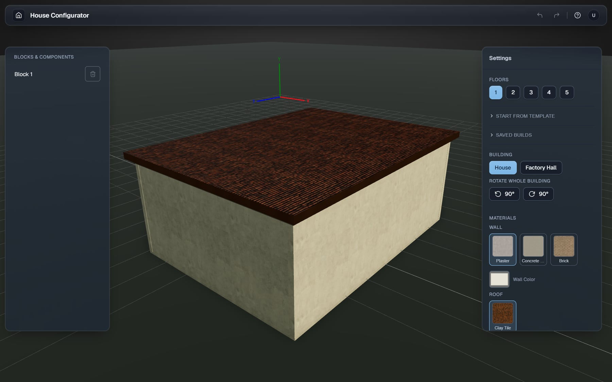
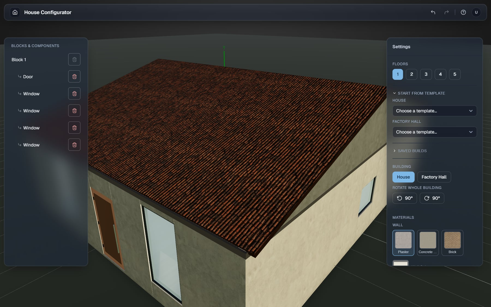
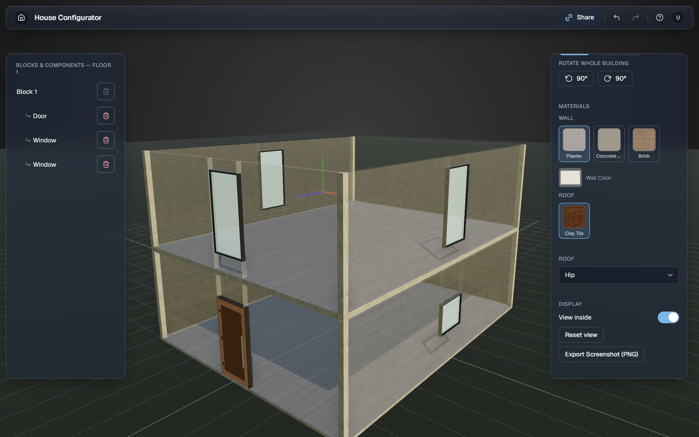
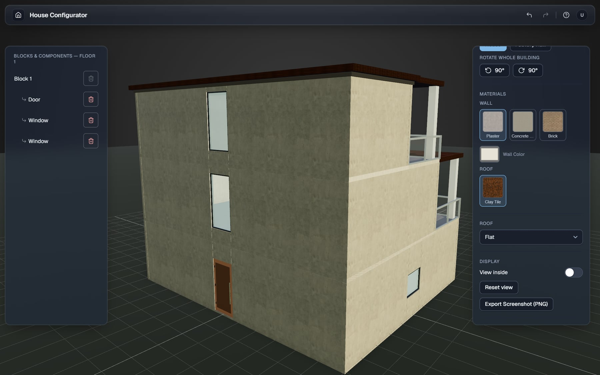
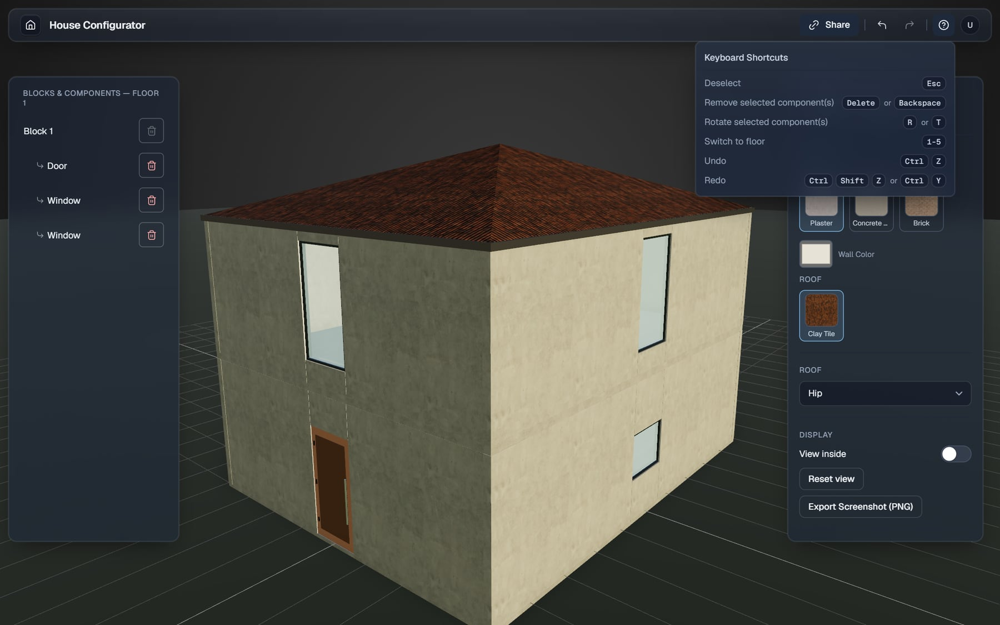
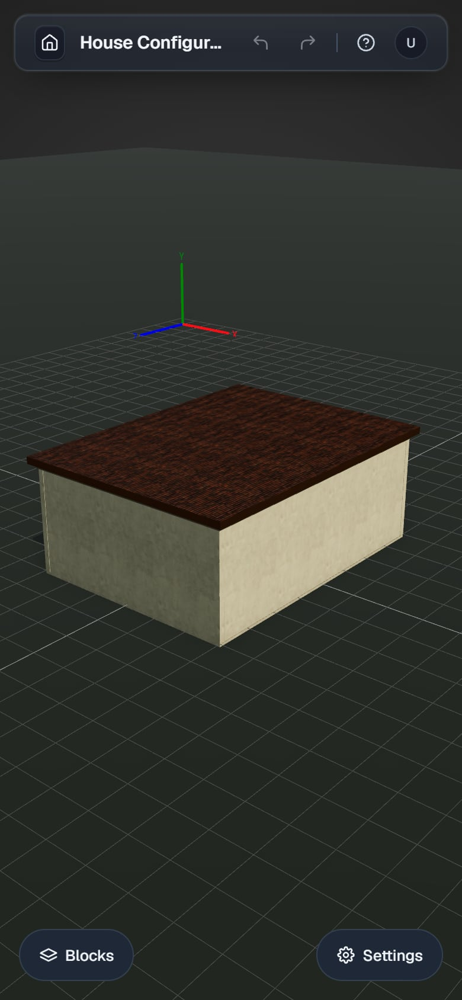

# House Configurator

Browser-based 3D house configurator (React, Three.js, Zustand). Live demo: https://lastch1ld.github.io/house-configurator/



## Screenshots

**Start from a template** and change floors, materials and roof type in the settings panel.



**View inside** hides the walls so you can check floors, doors and windows.



**Stepped and multi-floor layouts** with terraces, balconies and railings.



**Keyboard shortcuts** for undo, redo, rotate, delete and switching floors.



**On phones** the side panels become bottom sheets.



## Development

The UI comes from `@lastch1ld/ui`, a **private** GitHub package. The source here is public, but `npm install`
only works with a token that can read it; the live demo is the way to try it without that.

```ini
# ~/.npmrc (not committed)
//npm.pkg.github.com/:_authToken=<token with read:packages>
```

```bash
npm install
npm run dev   # http://localhost:5173
npm test
npm run build
```

## Deploy

Every push to `main` builds and publishes to GitHub Pages (`.github/workflows/pages.yml`). The workflow reads the
private package with its built-in token; this repo is allowed under the package's "Manage Actions access".
