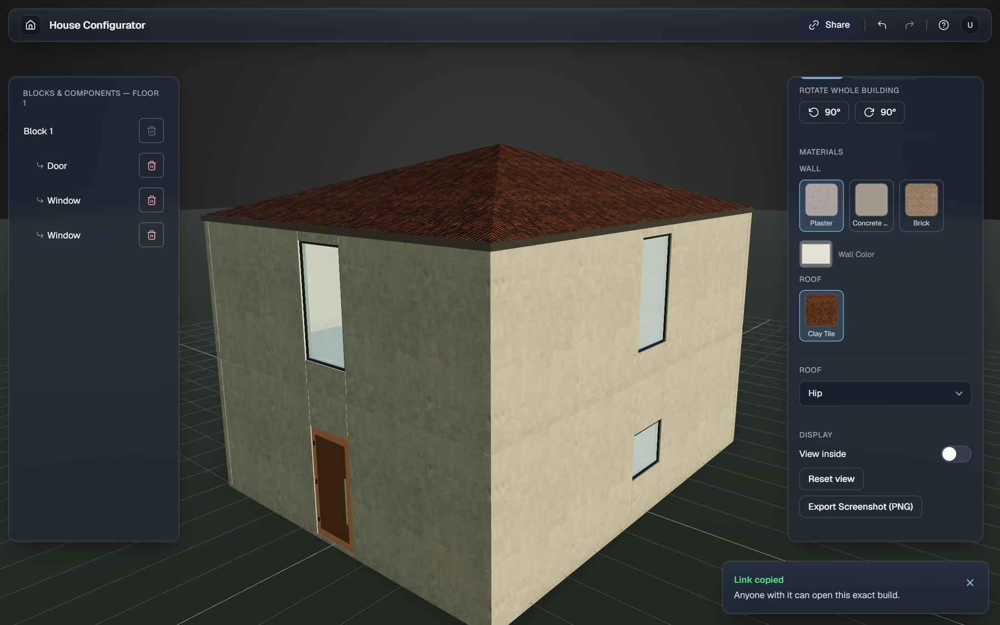

# House Configurator

Browser-based 3D house configurator (React, Three.js, Zustand). Live demo: https://lastch1ld.github.io/house-configurator/


## Screenshots

**Start from a template** and change floors, materials and roof type in the settings panel.


**View inside** hides the walls so you can check floors, doors and windows.


**Stepped and multi-floor layouts** with terraces, balconies and railings.


**Keyboard shortcuts** for undo, redo, rotate, delete and switching floors.


**Share a build** with one click. The link carries the whole building in the URL (compressed, no server), so anyone can open the exact same build. Builds with an imported 3D model are too large for a link and are not shareable.



**On phones** the side panels become bottom sheets.


## Performance

The scene renders only when something changes, so it uses no GPU while you are not interacting. While you orbit, the pixel ratio drops briefly for smooth movement on weaker graphics cards, then returns to full quality.

## Development

```bash
npm install
npm run dev   # http://localhost:5173
npm test
npm run build
```

## Deploy

Every push to `main` builds and publishes to GitHub Pages (`.github/workflows/pages.yml`).
